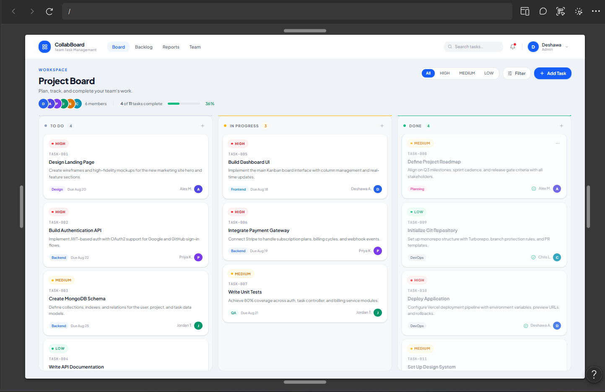

# CollabBoard Wireframes

## Overview

The wireframes define the responsive user interface for CollabBoard,
a collaborative Kanban-style task management application.

## Desktop Layout

## Mobile Layout

!Mobile wireframe will be added during the responsive UI implementation.

## Figma Design

[View the CollabBoard wireframes in Figma](https://www.figma.com/make/C7CI0GduNBmpXvvFU1iSRt/CollabBoard-Kanban-Wireframe?t=6gXE45wVxi6uNF2P-20&fullscreen=1)

## Component Structure

The interface is divided into the following reusable React components:

- **Header** — application branding and user information
- **Board** — main Kanban board containing columns
- **Column** — individual To Do, Doing, or Done column
- **TaskCard** — individual task displayed within a column

